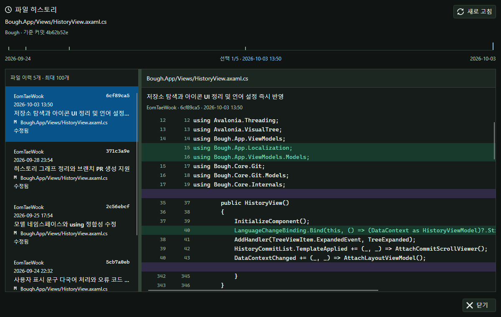

# 파일 히스토리

History의 변경 파일 우클릭 **히스토리**에서 파일 전용 창을 바로 연다. [커밋 상세](CommitInspection.md)의 Commit·Changes 탭과 독립된 읽기 전용 창이며, 선택한 커밋까지의 파일 변경을 탐색한다.

## 화면

- 상단: 파일 경로, 저장소 이름, 기준 커밋, 새로 고침.
- 날짜 축: 실제 작성 시각 위치에 커밋을 표시하고 현재 선택을 강조한다. 위치를 클릭하면 가장 가까운 커밋을 선택한다. 키보드로는 왼쪽 목록을 탐색한다.
- 왼쪽: 최신순 파일 커밋 목록. 작성자·작성 시각·짧은 SHA·메시지·Git 파일 상태·경로를 표시한다. 이름 변경은 이전 경로와 새 경로를 함께 표시한다.
- 오른쪽: 선택 커밋과 첫 번째 부모의 diff. 루트 커밋은 빈 트리와 비교한다. 이전·현재 줄 번호, 추가·삭제 배경색, 텍스트 선택과 복사, 세로·가로 스크롤을 제공한다. 원문 `@@`와 patch 메타데이터는 코드 행으로 표시하지 않는다.
- 두 영역 사이의 분할선을 조절할 수 있다. 목록과 diff는 각각 스크롤하며 창 크기를 조절해도 본문 영역을 유지한다.
- 창을 즉시 열고 조회 중·빈 이력·조회 오류를 창 안에 표시한다. 조회 중단은 현재 읽기 요청을 취소하고 새로 고침이나 다른 커밋 선택으로 이어갈 수 있다. 바이너리·크기 제한·인코딩·gitlink 등의 diff 제한 사유도 같은 위치에 표시한다. 내용 hunk가 없는 경로·속성 변경에는 별도 안내를 표시한다.

현재 Core 조회는 **최근 최대 100개**를 제공한다. 목록 위에 이 제한을 표시하며 전체 이력을 조회한 것으로 안내하지 않는다. 이후 페이지 확장은 별도 기능이다.

## 실행과 책임

- 메뉴를 연 시점의 저장소 루트·커밋·파일 경로를 `HistoryFileActionContext`에 고정한다. 클릭 시 현재 선택과 다르면 기존 공통 오류로 알리고 다른 파일을 열지 않는다.
- 열린 창은 고정된 기준으로 독립적으로 유지한다. 메인 화면의 저장소나 커밋 전환으로 열린 창의 기준을 바꾸지 않는다.
- `GitCommitInspectionService`가 `log --follow`의 NUL 경계·UTF-8·literal 경로를 처리하고 이름 변경을 따라간다. diff 조회는 각 이력 항목의 당시 경로와 이전 경로를 사용한다.
- `FileHistoryPresenter`가 조회·취소·요청 버전·선택 유효성·결과 적용을 담당한다. 새 선택과 새로 고침은 이전 조회를 취소하고, 이전 오류도 현재 창을 덮지 못하게 한다. 창을 닫으면 구독과 조회를 정리한다.
- `FileHistoryViewModel`은 원본 결과와 바인딩 상태를 보관한다. `FileHistoryWindow`가 공유 문자열·테마와 언어 변경을 표시한다. 언어 변경은 Git을 다시 조회하지 않는다.
- 조회는 변경 명령 FIFO에 넣지 않는다. 파일·인덱스·참조를 변경하는 동작은 제공하지 않는다.

## 반영 상태

2026-10-06 전용 창·메뉴 연결·Core 파일 상태·한영 문자열을 반영했다. 사용자의 화면 표시 요청 범위에서 촬영용 실행 파일을 생성하고 실제 Bough 저장소의 파일 이력과 diff를 렌더했다. 별도 테스트·임시 저장소 하네스·메뉴 조작 및 회귀 검증은 수행하지 않았다.

