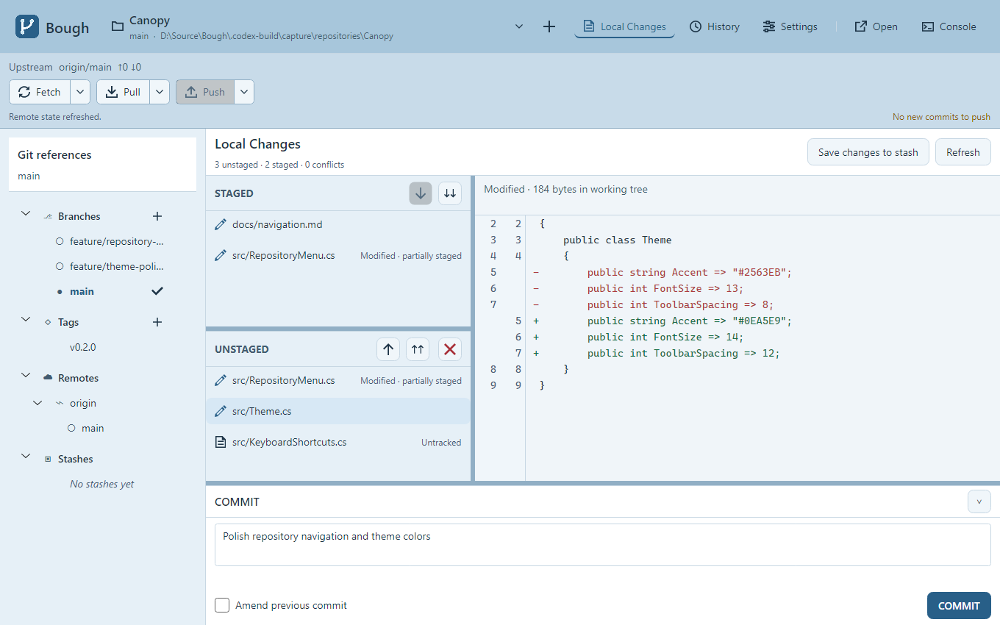

# Bough

[한국어](README.md) | **English**

**Bough is a Git GUI for macOS and Windows that makes merge conflicts easier to understand and resolve.**

It aims to keep everyday Git work light and fast while making the context and outcome of conflict resolution clear.

## Download

[Windows x64 public beta downloads and release notes](https://github.com/EomTaeWook/Bough/releases)

Run the downloaded single `.exe` file. No archive extraction or separate .NET installation is needed; Git must be installed. This beta provides a Windows x64 executable. On macOS, use the source build instructions below.

## Preview

### Conflict resolution


This screen shows a reproduced text merge conflict. Compare the origins of both changes, resolve individual sections or apply one choice to the remaining sections in the current file, and edit the final result.

### History


See the branch graph alongside local branch, remote branch, and tag badges, then inspect the selected merge commit and its changed files.

### Local changes



Browse staged changes and working files separately, and read diffs with previous and current line numbers. Prepare a commit message in the area below the preview.

The screenshots show actual app content from demo repositories using the light theme and English UI. Operating system title bars are omitted.

## Why Bough?

Conflict resolution in existing Git GUIs can be difficult when:

- It is unclear where each side of a conflict came from.
- There is too little context to decide which changes to keep.
- The effect of a choice on the final file is hard to see immediately.
- Repository tabs pile up across the top, making it harder to see where you are and switch repositories.

Bough is designed to show the source of each conflicting change and preview the resulting file as you make selections.

## Core experience

- **Clear change origins:** Distinguish the branches, commits, and other context behind each change.
- **Readable conflict comparison:** See conflicting sections alongside surrounding code.
- **Immediate result preview:** See how each choice changes the final file.
- **Review before applying:** Check the result before saving the file and continuing your Git work.
- **Clear repository navigation:** See and switch the current repository without relying on a row of tabs.

## Features

- **Open and clone repositories:** Open an existing local repository, or clone a remote URL or local path into a new path or an empty folder and add it to the repository list.
- **Local changes:** Inspect changed files and diffs with line numbers, stage and unstage, commit, discard changes, stop tracking files, and ignore untracked files.
- **History and references:** Browse the commit graph and file changes; create, switch, delete, and rename branches; create, delete, and rename tags.
- **Remotes and stashes:** Fetch, Pull, and Push; configure the default Pull strategy or choose one for a single Pull; save, apply, and delete stashes.
- **Conflict resolution:** Inspect merge or rebase changes, choose individual sections or apply one choice to the remaining sections, edit and preview the result, then save and stage it or continue a rebase.

Features and workflows are still being refined.

Additional screens and workflows are described in the [design notes](Design/README.md) (Korean).

## Technology

- **Language:** C# / .NET
- **Platforms:** macOS and Windows
- **UI:** Avalonia

The project is under active development. [Implementation status](Docs/CurrentStatus.md) (Korean) separates available features from checks still pending. See [development docs](Docs/README.md) and [design notes](Design/README.md) for more detail.

## Run

### Run the release

1. Install Git. If Bough cannot find it, set the `git.exe` path under **Settings → Git executable**.
2. Save the Windows x64 `.exe` from the download link above in a folder of your choice and run it. No archive extraction, separate .NET installation, or copying of DLLs, data, or configuration files is required.
3. Use **+ → Open repository** in the top toolbar to select an existing repository, or **+ → Clone** to enter a remote URL or local path and a destination folder. The destination can be a new path or an empty folder.
4. Select the current repository in the header to switch between recent repositories. Review files and diffs under **Local changes**, stage files, and commit. Use **History** to browse past commits.
5. Choose Korean or English under **Settings → Language**. Korean is the default; changes apply immediately and are saved for the next launch.

User settings and recent repositories are stored in `%LocalAppData%\Bough` on Windows. Replacing the executable with an updated version preserves these settings.

### Run from source

Development requires the .NET 10 SDK and Git. Run the following command from the repository root. macOS can also run from source; this beta does not include a macOS package.

```powershell
dotnet run --project Bough.App/Bough.App.csproj
```

### Work with repositories

Bough adds and opens the repository when cloning finishes. The list's remove button appears on hover or keyboard focus. If the repository has unresolved conflicts, choose a change for each section, inspect or edit the final file, and select **Save and Stage**. Text conflict resolution currently targets UTF-8 files.

When cloning fails, Bough shows the cause identified from Git diagnostics, such as authentication, repository access, connection, storage space, or file writing. Destination status is reported separately. If the folder is empty, you can retry using the same path after resolving the clone error. When the cause cannot be identified, Bough shows a general failure message and the exit code.

Select **History** at the top to see commits from all local and remote references in a branch graph. Selecting a commit shows its author, date, message, and changed files in the details panel. The first 200 commits are shown; scroll down to load older history. Selecting and inspecting a commit does not change the repository.

Right-click a branch under **Git references** on the left to delete a local or remote branch. Confirm the target before deletion. The checked-out branch and a remote's default branch cannot be deleted, and local branches with unmerged commits are kept. Deleting a remote branch affects the server and other users.

For tags, **Delete tag** opens one dialog to choose local or remote deletion, with local selected by default. Remote deletion inspects the actual tag on the selected server and requires confirmation of its impact; the local tag is preserved. Renaming a local branch or tag does not rename remote references. Annotated and signed tags keep their original tag object. Deletion and renaming run through the repository operation queue after confirmation.

## Data generation

`Excel/String.xlsx` is intended as the source of UI strings, and the app reads `Datas/String.json`. Existing entries in the two files are not fully synchronized. Before regenerating all data, review the synchronization note in the [data conversion guide](<Docs/데이터 변환 도구 사용법.md>) (Korean).

`JsonToCSharp.exe` is managed with Git LFS. If the executable is missing after cloning the repository, install Git LFS and run `git lfs pull` from the repository root.

```powershell
cd ExportTools/ExcelToJson
./ExcelToJson.exe --no-pause
cd ../JsonToCSharp
./JsonToCSharp.exe --no-pause
```

The bundled converter may exit with a `Console.ReadKey` exception after generating the files. If that happens, check both the completion message and changes to the generated output. UI text is read from `StringTemplate` using the language selected in the app settings.

## License

[Bough Source License 1.0](LICENSE) allows free personal, educational, and internal business use and modification. You may redistribute it without charge if you retain the license and copyright notice. Selling Bough or a substantially Bough-based Git client, including a renamed copy, is restricted. Third-party components remain under their own licenses.
