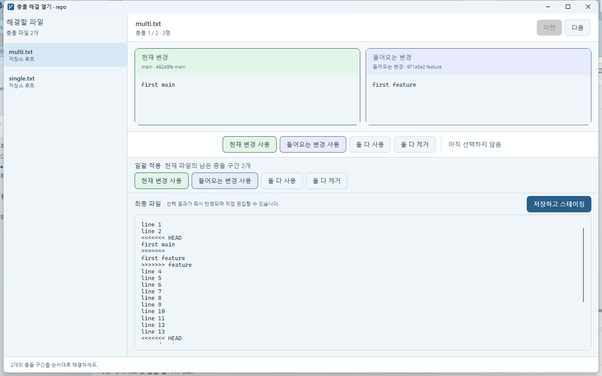
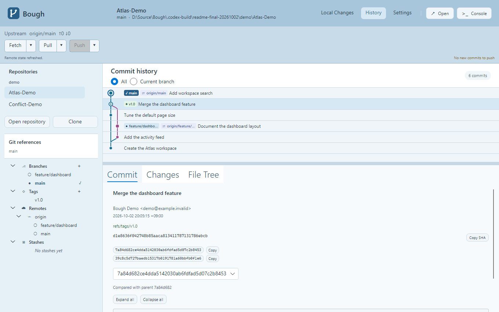

# Bough

[한국어](README.md) | **English**

**Bough is a Git GUI for macOS and Windows that makes merge conflicts easier to understand and resolve.**

It aims to keep everyday Git work light and fast while making the context and outcome of conflict resolution clear.

## Preview

### Conflict resolution



This screen shows a reproduced text merge conflict. Compare both changes, choose how to resolve each section, and review the final file.

### History



## Why Bough?

Conflict resolution in existing Git GUIs can be difficult when:

- It is unclear where each side of a conflict came from.
- There is too little context to decide which changes to keep.
- The effect of a choice on the final file is hard to see immediately.
- Repository tabs pile up across the top, making it harder to see where you are and switch repositories.

Bough is designed to show the source of each conflicting change and preview the resulting file as you make selections.

## Core experience

- **Clear change origins:** Distinguish the branches, commits, and other context behind each change.
- **Readable conflict comparison:** See conflicting sections alongside surrounding code.
- **Immediate result preview:** See how each choice changes the final file.
- **Review before applying:** Check the result before saving the file and continuing your Git work.
- **Clear repository navigation:** See and switch the current repository without relying on a row of tabs.

## Features

- **Local changes:** Inspect changed files and diffs, stage and unstage, commit, discard changes, and ignore untracked files.
- **History and references:** Browse the commit graph and file changes; create, switch, and delete branches; create tags.
- **Remotes and stashes:** Fetch, Pull, and Push; save, apply, and delete stashes.
- **Conflict resolution:** Inspect both sides of a conflict, choose or edit the result, preview it, then save and stage it.

Features and workflows are still being refined.

Additional screens and workflows are described in the [design notes](Design/README.md) (Korean).

## Technology

- **Language:** C# / .NET
- **Platforms:** macOS and Windows
- **UI:** Avalonia

The project is under active development. It provides conflict file navigation, selection between both sides, editing and staging the result, and commit history browsing. Usability improvements are ongoing.

## Run

You need the .NET 10 SDK and Git.

```powershell
dotnet run --project Bough.App/Bough.App.csproj
```

Add a repository from the left sidebar to see unresolved conflict files. For each conflict section, choose a change, inspect or edit the final file, and select **Save and Stage**. Text conflict resolution currently targets UTF-8 files.

Select **History** at the top to see commits from all local and remote references in a branch graph. Selecting a commit shows its author, date, message, and changed files in the details panel. The first 200 commits are shown; use **Load more commits** to browse older history. Selecting and inspecting a commit does not change the repository.

Right-click a branch under **Git references** on the left to delete a local or remote branch. Confirm the target before deletion. The checked-out branch and a remote's default branch cannot be deleted, and local branches with unmerged commits are kept. Deleting a remote branch affects the server and other users.

## Data generation

`Excel/String.xlsx` is the source of UI strings. `Datas/String.json` and `DataContainer/Generated` are generated outputs. Run each converter from the folder that contains its executable.

`JsonToCSharp.exe` is managed with Git LFS. If the executable is missing after cloning the repository, install Git LFS and run `git lfs pull` from the repository root.

```powershell
cd ExportTools/ExcelToJson
./ExcelToJson.exe --no-pause
cd ../JsonToCSharp
./JsonToCSharp.exe --no-pause
```

The bundled converter may exit with a `Console.ReadKey` exception after generating the files. If that happens, check both the completion message and the generated output. UI text is read from `StringTemplate`: Korean is used when the operating system UI language is Korean, and English is used otherwise.

## License

[Bough Source License 1.0](LICENSE) allows free personal, educational, and internal business use and modification. You may redistribute it without charge if you retain the license and copyright notice. Selling Bough or a substantially Bough-based Git client, including a renamed copy, is restricted. Third-party components remain under their own licenses.
